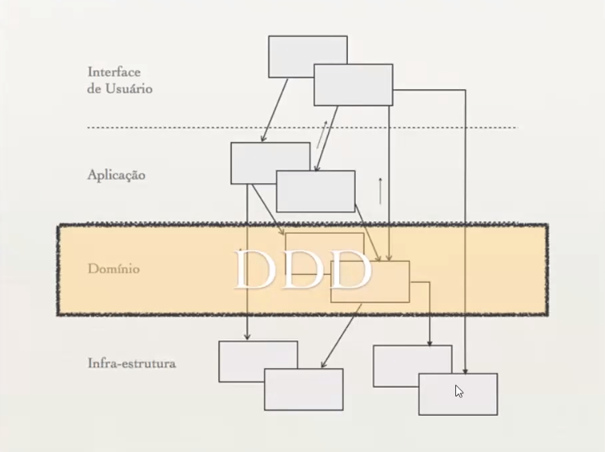

# Caderno de Aula

## Desenvolvendo Uma Aplicação com C# usando DDD

### Conceito sobre DDD

**Domain Driven Design**: é uma abordagem de design de software disciplinada que reune um conjunto de conceitos, técnicas e princípios para a construção de softwares baseados em um modelo de domínio.

*Domínio é todo e qualquer conhecimento utilizado em uma determinada área.*

**Principais Conceitos**:

- **Alinhamento do código com o negocio**: usar linguagem úbiqua (comum entre todos) para descrever o domínio e suas regras;
- **Favorecer a reautilização**: aproveitar um mesmo conceito de domínio ou um mesmo codigo em vários lugares;
- **Mínimo de acoplamento**: várias partes de um sistema interagem sem que haja muita dependência entre módulos ou classes de objetos de conceitos distintos;
- **Independência da Tecnologia**: DDD não foca em tecnologia, mas sim em entender as regras de negocio e como elas devem estar refletidas no código e no modelo de domínio;

### Criando um modelo de domínio (MDD)

A idéia por trás da MDD é a de que o seu modelo abstrato deve ser uma representação perfeita do seu domínio.

O desenho do modelo é criado em conjunto entre especialistas de negócio e domínio, analistas, arquitetos e desenvolvedores, utilizando a linguagem úbiqua.

O processo de maturação de um sistema desenvolvido usando MDD deve ser contínuo. O modelo servirá de guia para a criação do codigo e, ao mesmo tempo, o codigo ajuda a aperfeiçoar o modelo.

Blocos de construção do MDD:
Uma vez que decidimos criar um modelo usando MDD, precisamos, inicialmente isolar o modelo de domínio das demais partes que compõem o sistema. Essa separação pode ser feita utilizando-se uma arquitetura em camadas, que dividirá nossa aplicação em quatro partes:

- **Interface de Usuário**: interação com o usuario (exibição de informações e interpretar comandos do usuário);
- **Aplicação**: conecta a interface do usuario às camadas inferiores;
- **Domínio**: representa os conceitos, regras e lógicas de negócio.
- **Infra-estrutura**: fornece recursos técnicos que darão suporte às camadas superiores.

### Regras para modelagem de domínio

**Entidades**: são objetos que necessitam de uma identidade.Normalmente são elementos de domínio que possuem um ciclo de vida dentro da aplicação: um Cliente, por exemplo, se cadastra no sistema, faz compras, se torna inativo, é excluido, etc.

**Objetos de Valores**: objetos que só carrega valores mas não possuem distinção de identidade e suas instâncias são imutáveis. Exemplos de objetos de valores: string, números, cores.

**Agregados**: compostos de Entidades ou Objetos de valores que são encapsulados numa única classe. O agregado serve para manter a integridade do modelo. Elegemos uma classe para servir de raiz do agregado. Quando algum cliente quiser manipular dados de uma das classes que compõe o Agregado, essa manipulação só poderá ser feita através da raiz.

**Fábricas**: classes responsáveis pelo processo de criação dos Agregados ou Objetos de valores. Ao contrário de armazenar a lógica de criação desses Agregados nnas classes que o compõe, extraímos as regras de criação para uma classe externa: a fábrica.

**Serviços**: classes que contém logicas de negócio mas não pertencem a nenhuma Entidade ou Objetos de valores.

**Repositórios**: são classes responsáveis por administrar o ciclo de vida de outros objetos, como: Entidades, Objetos de valores e Agregados. e que centralizam operações de criação, alteração e remoção de objetos.

**Modulos**: abstrações que têm com o objetivos agrupar classes port um determinado conceito do domínio. A maioria das linguagens de programação oferecem suporte a modulos (pacotes em Java, namespaces em .NET ou módulos em Ruby)

### Arquitetura Padrão do DDD

---

[Daniel Jr](https://web.digitalinnovation.one/users/danielmarcelo_junior)